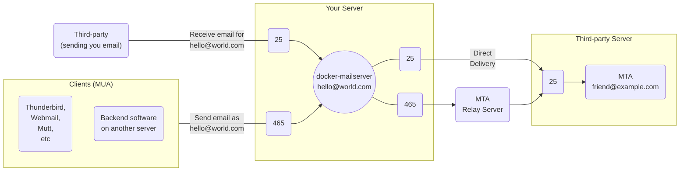

## Quick Reference

Prefer Implicit TLS ports, they're more secure and if you use a Reverse Proxy, should be less hassle (although it's probably wiser to expose these ports directly to `docker-mailserver`).

## Overview of Email Ports

| Protocol | Explicit TLS1 | Implicit TLS    | Purpose              |
|----------|--------------------------|-----------------|----------------------|
| SMTP     | 25                       | N/A             | Transfer2 |
| ESMTP    | 587                      | 4653 | Submission           |
| POP3     | 110                      | 995             | Retrieval            |
| IMAP4    | 143                      | 993             | Retrieval            |

1. A connection *may* be secured over TLS when both ends support `STARTTLS`. On ports 110, 143 and 587, `docker-mailserver` will reject a connection that cannot be secured. Port 25 is [required][ref-port25-mandatory] to support insecure connections.
2. Receives email, `docker-mailserver` additionally filters for spam and viruses. For submitting email to the server to be sent to third-parties, you should prefer the *submission* ports(465, 587) - which require authentication. Unless a relay host is configured(eg SendGrid), outgoing email will leave the server via port 25(thus outbound traffic must not be blocked by your provider or firewall).
3. A *submission* port since 2018 ([RFC 8314][rfc-8314]). Previously a secure variant of port 25.

### What Ports Should I Use? (SMTP)

---

#### Inbound Traffic (On the left)

- **Port 25:** Think of this like a physical mailbox, it is open to receive email from anyone who wants to. `docker-mailserver` will actively filter email delivered on this port for spam or viruses and refuse mail from known bad sources. While you could also use this port internally to send email outbound without requiring authentication, you really should prefer the *Submission* ports(587, 465).
- **Port 465(*and 587*):** This is the equivalent of a post office box where you would send email to be delivered on your behalf(`docker-mailserver` is that metaphorical post office, aka the MTA). Unlike port 25, these two ports are known as the *Submission* ports and require a valid email account on the server with a password to be able to send email to anyone outside of the server(an MTA you do not control, eg Outlook or Gmail). Prefer port 465 which provides Implicit TLS.

#### Outbound Traffic (On the Right)

- **Port 25:** Send the email directly to the given email address MTA as possible. Like your own `docker-mailserver` port 25, this is the standard port for receiving email on, thus email will almost always arrive to the final MTA on this port. Note that, there may be additional MTAs further in the chain, but this would be the public facing one representing that email address.
- **Port 465(*and 587*):** SMTP Relays are a popular choice to hand-off delivery of email through. Services like SendGrid are useful for bulk email(marketing) or when your webhost or ISP are preventing you from using standard ports like port 25 to send out email(which can be abused by spammers). 
  
  `docker-mailserver` can serve as a relay too, but the difference between a DIY relay and a professional service is reputation, which is referenced by MTAs you're delivering to such as Outlook, Gmail or others(perhaps another `docker-mailserver` server!), when deciding if email should be marked as junked or potentially not delivered at all. As a service like SendGrid has a reputation to maintain, relay is restricted to registered users who must authenticate(even on port 25), they do not store email, merely forward it to another MTA which could be delivered on a different port like 25.

### Explicit vs Implicit TLS

#### Explicit TLS (aka Opportunistic TLS) - Opt-in Encryption

Communication on these ports begin in [cleartext][ref-clear-vs-plain], indicating support for `STARTTLS`. If both client and server support `STARTTLS` the connection will be secured over TLS, otherwise no encryption will be used.

Support for `STARTTLS` is not always implemented correctly, which can lead to leaking credentials(client sending too early) prior to a TLS connection being established. Third-parties such as some ISPs have also been known to intercept the `STARTTLS` exchange, modifying network traffic to prevent establishing a secure connection.

Due to these security concerns, [RFC 8314 (Section 4.1)][rfc-8314-s41] encourages you to **prefer Implicit TLS ports where possible**. 

#### Implicit TLS - Enforced Encryption

Communication is always encrypted, avoiding the above mentioned issues with Explicit TLS.

You may know of these ports as **SMTPS, POP3S, IMAPS**, which indicate the protocol in combination with a TLS connection. However, Explicit TLS ports provide the same benefit when `STARTTLS` is successfully negotiated; Implicit TLS better communicates the improved security to all three protocols (SMTP/POP3/IMAP over Implicit TLS).

Additionally, referring to port 465 as *SMTPS* would be incorrect, as it is a submissions port requiring authentication to proceed via *ESMTP*, whereas ESMTPS has a different meaning(STARTTLS supported). Port 25 may lack Implicit TLS, but can be configured to be more secure between trusted parties via MTA-STS, STARTTLS Policy List, DNSSEC and DANE.

## Security

!!! todo
    This section should provide any related configuration advice, and probably expand on and link to resources about DANE, DNSSEC, MTA-STS and STARTTLS Policy list, with advice on how to configure/setup these added security layers.

!!! todo
    A related section or page on ciphers used may be useful, although less important for users to be concerned about.

### TLS connections for a Mail-Server, compared to web browsers

Unlike with HTTP where a web browser client communicates directly with the server providing a website, a secure TLS connection as discussed below is not the equivalent safety that HTTPS provides when the transit of email (receiving or sending) is sent through third-parties, as the secure connection is only between two machines, any additional machines (MTAs) between the MUA and the MDA depends on them establishing secure connections between one another successfully.

Other machines that facilitate a connection that generally aren't taken into account can exist between a client and server, such as those where your connection passes through your ISP provider are capable of compromising a cleartext connection through interception.

[ref-clear-vs-plain]: https://www.denimgroup.com/resources/blog/2007/10/cleartext-vs-pl
[ref-port25-mandatory]: https://serverfault.com/questions/623692/is-it-still-wrong-to-require-starttls-on-incoming-smtp-messages
[rfc-8314]: https://tools.ietf.org/html/rfc8314
[rfc-8314-s41]: https://tools.ietf.org/html/rfc8314#section-4.1
