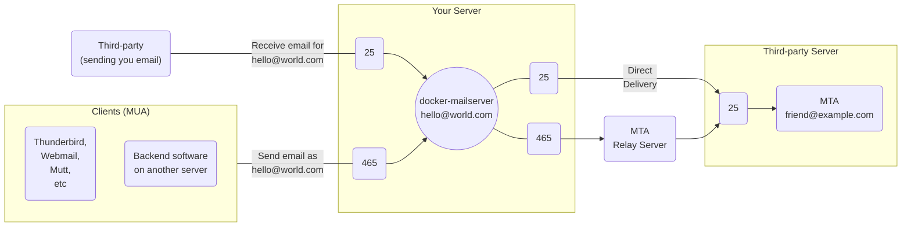

## Quick Reference

Prefer ports with Implicit [TLS][wikipedia-tls] ports, they're more secure than ports using Explicit TLS, and if you use a Reverse Proxy should be less hassle.

## Overview of Email Ports

| Protocol                 | Explicit TLS1 | Implicit TLS    | Purpose              | Enabled by Default |
|--------------------------|--------------------------|-----------------|----------------------|--------------------|
| [ESMTP][wikipedia-esmtp] | 25                       | N/A             | Transfer2 | Yes                |
| ESMTP                    | 587                      | 4653 | Submission           | Yes                |
| POP3                     | 110                      | 995             | Retrieval            | No                 |
| IMAP4                    | 143                      | 993             | Retrieval            | Yes                |

1. A connection _may_ be secured over TLS when both ends support `STARTTLS`. On ports 110, 143 and 587, DMS will reject a connection that cannot be secured. Port 25 is [required][ref-port25-mandatory] to support insecure connections.
2. Receives email, DMS additionally filters for spam and viruses. For submitting email to the server to be sent to third-parties, you should prefer the _submission_ ports (465, 587) - which require authentication. Unless a relay host is configured (eg: SendGrid), outgoing email will leave the server via port 25 (_thus outbound traffic must not be blocked by your provider or firewall_).
3. A _submission_ port since 2018 ([RFC 8314][rfc-8314]).

??? warning "Beware of outdated advice on port 465"

    There is a common misconception of this port due to it's history detailed by various communities and blogs articles on the topic (_including by popular mail relay services_).

    Port 465 was [briefly assigned the role of SMTPS in 1997][wikipedia-smtps] as an secure alternative to Port 25 between MTA exchanges. Then RFC 2487 (`STARTTLS`) [while still in a draft status in late 1998 had IANA revoke the SMTPS assignment][history-465-revoked]. The [draft history was modified to exclude all mention of port 465 and SMTPS][history-465-politics].

    In 2018 [RFC 8314][rfc-8314] was published which revives Port 465 as an Implicit TLS alternative to Port 587 for mail submission. It details very clearly that gaining adoption of 465 as the preferred port will take time. IANA reassigned [port 465 as the `submissions` service][iana-services-465]. Any unofficial usage as **SMTPS is legacy and has been for over two decades**.

    Understand that port 587 is more broadly supported due to this history and that lots of software in that time has been built or configured with that port in mind. [`STARTTLS` is known to have various CVEs discovered even in recent years][starttls-vulnerabilities], do not be misled by any advice implying it should be preferred over implicit TLS. Trust in more official sources, such as the [config Postfix has][postfix-upstream-config-mastercf] which acknowledges the `submissions` port (465).

### What Ports Should I Use? (SMTP)

---

#### Inbound Traffic (On the left)

Mail arriving at your server will be processed and stored in a mailbox, or sent outbound to another mail server.

- **Port 25:**
    - Think of this like a physical mailbox, anyone can deliver mail to you here. Typically most mail is delivered to you on this port.
    - DMS will actively filter email delivered on this port for spam or viruses, and refuse mail from known bad sources.
    - Connections to this port may be secure through STARTTLS, but is not mandatory as [mail is allowed to arrive via an unencrypted connection][ref-port25-mandatory].
    - It is possible for internal clients to submit mail to be sent outbound (_without requiring authentication_), but that is discouraged. Prefer the _submission_ ports.
- **Port 465 and 587:**
    - This is the equivalent of a post office box where you would send email to be delivered on your behalf (_DMS is that metaphorical post office, aka the MTA_).
    - These two ports are known as the _submission_ ports, they enable mail to be sent outbound to another MTA (eg: Outlook or Gmail) but require authentication via a [mail account][docs-accounts].
    - For inbound traffic, this is relevant when you send mail from your MUA (eg: ThunderBird). It's also used when DMS is configured as a mail relay, or when you have a service sending transactional mail (_eg: order confirmations, password resets, notifications_) through DMS.
    - _**Prefer port 465**_ over port 587, as 465 provides Implicit TLS.

!!! note

    When submitting mail (inbound) to be sent (outbound), this involves two separate connections to negotiate and secure. There may be additional intermediary connections which DMS is not involved in, and thus unable to ensure encrypted transit throughout delivery.

#### Outbound Traffic (On the Right)

Mail being sent from your server is either being relayed through another MTA (eg: SendGrid), or direct to an MTA responsible for an email address (eg: Gmail).

- **Port 25:**
    - As most MTA use port 25 to receive inbound mail, when no authenticated relay is involved this is the outbound port used.
    - Outbound traffic on this port is often blocked by service providers (eg: VPS, ISP) to prevent abuse by spammers. If the port cannot be unblocked, you will need to relay outbound mail through a service to send on your behalf.
- **Port 465 and 587:**
    - Submission ports for outbound traffic establish trust to forward mail through a third-party relay service. This requires [authenticating to an account on the relay service][docs-relays]. The relay will then deliver the mail through port 25 on your behalf.
    - These are the two typical ports used, but smart hosts like SendGrid often document support for additional non-standard ports as alternatives if necessary.
    - Usually you'll only use these outbound ports for relaying. It is possible to deliver directly to the relevant MTA for email address, but requires having credentials for each MTA.

!!! tip

    DMS can function as a relay too, but professional relay services have a trusted reputation (_which increases success of delivery_).

    An MTA with low reputation can affect if mail is treated as junk, or even rejected.

!!! note

    At best, you can only ensure a secure connection between the MTA you directly connect to. The receiving MTA may relay that mail to another MTA (_and so forth_), each connection may not be enforcing TLS.

### Explicit vs Implicit TLS

#### Explicit TLS (aka Opportunistic TLS) - Opt-in Encryption

Communication on these ports begin in [cleartext][ref-clear-vs-plain]. Upgrading to an encrypted connection must be requested explicitly through the `STARTTLS` protocol **and** successfully negotiated.

Sometimes a reverse-proxy is involved, but is misconfigured or lacks support for the `STARTTLS` negotiation to succeed.

!!! note

    - By default, DMS is configured to reject connections that fail to establish a secure connection (_when authentication is required_), rather than allow an insecure connection.
    - Port 25 does not require authentication. If `STARTTLS` is unsuccessful, mail can be received over an unencrypted connection. You can better secure this port between trusted parties with the addition of MTA-STS, [STARTTLS Policy List][starttls-policy-list], DNSSEC and DANE.

!!! warning

    `STARTTLS` [continues to have vulnerabilities found][starttls-vulnerabilities] (Nov 2021 article), as per [RFC 8314 (Section 4.1)][rfc-8314-s41] you are encouraged to **prefer Implicit TLS where possible**.

    Support for `STARTTLS` is not always implemented correctly, which can lead to leaking credentials (like a client sending too early) prior to a TLS connection being established. Third-parties such as some ISPs have also been known to intercept the `STARTTLS` exchange, modifying network traffic to prevent establishing a secure connection.

#### Implicit TLS - Enforced Encryption

Communication on these ports are always encrypted (_enforced, thus implicit_), avoiding the potential risks with `STARTTLS` (Explicit TLS).

While Explicit TLS can provide the same benefit (_when `STARTTLS` is successfully negotiated_), Implicit TLS more reliably avoids concerns with connection manipulation and compatibility.

## Security

!!! todo

    This section should provide any related configuration advice, and probably expand on and link to resources about DANE, DNSSEC, MTA-STS and STARTTLS Policy list, with advice on how to configure/setup these added security layers.

!!! todo

    A related section or page on ciphers used may be useful, although less important for users to be concerned about.

### TLS connections for a Mail Server, compared to web browsers

Unlike with HTTP where a web browser client communicates directly with the server providing a website, a secure TLS connection as discussed below does not provide the equivalent safety that HTTPS does when the transit of email (receiving or sending) is sent through third-parties, as the secure connection is only between two machines, any additional machines (MTAs) between the MUA and the MDA depends on them establishing secure connections between one another successfully.

Other machines that facilitate a connection that generally aren't taken into account can exist between a client and server, such as those where your connection passes through your ISP provider are capable of compromising a `cleartext` connection through interception.

[docs-accounts]: ../account-management/overview.md#accounts
[docs-relays]: ../advanced/mail-forwarding/relay-hosts.md
[iana-services-465]: https://www.iana.org/assignments/service-names-port-numbers/service-names-port-numbers.xhtml?search=465
[starttls-policy-list]: https://github.com/EFForg/starttls-everywhere#email-security-database-starttls-policy-list
[starttls-vulnerabilities]: https://blog.apnic.net/2021/11/18/vulnerabilities-show-why-starttls-should-be-avoided-if-possible/
[ref-clear-vs-plain]: https://www.denimgroup.com/resources/blog/2007/10/cleartext-vs-pl
[ref-port25-mandatory]: https://serverfault.com/questions/623692/is-it-still-wrong-to-require-starttls-on-incoming-smtp-messages
[rfc-8314]: https://tools.ietf.org/html/rfc8314
[rfc-8314-s41]: https://tools.ietf.org/html/rfc8314#section-4.1
[history-465-revoked]: https://web.archive.org/web/20150603202057/http://www.imc.org/ietf-apps-tls/mail-archive/msg00204.html
[history-465-politics]: https://mailing.postfix.users.narkive.com/F3ACwg2F/which-port-to-use-for-ssl-tls#post21
[postfix-upstream-config-mastercf]: https://github.com/vdukhovni/postfix/blob/62931e5b1f9f1e80d02a496c7fd0062a5aae1d25/postfix/conf/master.cf#L38-L41
[wikipedia-smtps]: https://en.wikipedia.org/wiki/SMTPS#History
[wikipedia-esmtp]: https://en.wikipedia.org/wiki/Simple_Mail_Transfer_Protocol#Modern_SMTP
[wikipedia-tls]: https://en.wikipedia.org/wiki/Transport_Layer_Security
